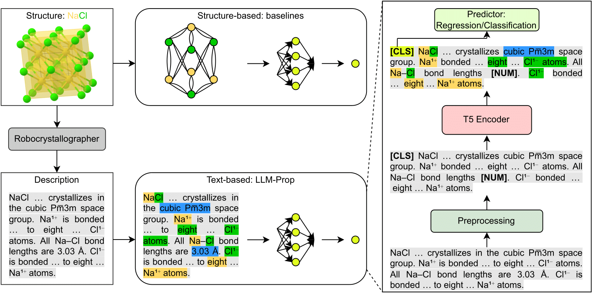

# [LLM-Prop: Predicting Physical And Electronic Properties Of Crystalline Solids From Their Text Descriptions](https://doi.org/10.48550/arXiv.2310.14029)
This repository contains the implementation of the LLM-Prop model. LLM-Prop is an efficiently finetuned large language model (T5 encoder) on crystals text descriptions to predict their properties. Given a text sequence that describes the crystal structure, LLM-Prop encodes the underlying crystal representation from its text description and output its properties such as band gap and volume. 

<!--  -->

<p align="center" width="100%">
    
    <br>
    <em>LLM-Prop architecture</em>
</p>

## Installation
You can install LLM-Prop by following these steps:
```
git clone https://github.com/vertaix/LLM-Prop.git
cd LLM-Prop
conda create -n <environment_name> requirement.txt
conda activate <environment_name>
```
## Usage
### Training LLM-Prop from scratch
Add the following scripts to [llmprop_train.sh](https://github.com/vertaix/LLM-Prop/tree/main/scripts/llmprop_train.sh)
```bash
#!/usr/bin/env bash

TRAIN_PATH="data/samples/textedge_prop_mp22_train.csv"
VALID_PATH="data/samples/textedge_prop_mp22_valid.csv"
TEST_PATH="data/samples/textedge_prop_mp22_test.csv"
EPOCHS=5 # the default epochs is 200 to get the best performance
TASK_NAME="regression" # the task name can also be set to "classification"
PROPERTY="band_gap" # the property can also be set to "volume" or "is_gap_direct". Note that if the task name is set to classification, only "is_gap_direct" is allowed here. And if the task name is set to regression, only "band_gap" or "volume" is allowed here.

python llmprop_train.py \
--train_data_path $TRAIN_PATH \
--valid_data_path $VALID_PATH \
--test_data_path $TEST_PATH \
--epochs $EPOCHS \
--task_name $TASK_NAME \
--property $PROPERTY

```
Then run ``` bash scripts/llmprop_train.sh ```

### Evaluating the pretrained LLM-Prop
Add the following scripts to [llmprop_evaluate.sh](https://github.com/vertaix/LLM-Prop/tree/main/scripts/llmprop_evaluate.sh)
```bash
#!/usr/bin/env bash

TRAIN_PATH="data/samples/textedge_prop_mp22_train.csv"
TEST_PATH="data/samples/textedge_prop_mp22_test.csv"
TASK_NAME="regression" # the task name can also be set to "classification"
PROPERTY="band_gap" # the property can also be set to "volume" or "is_gap_direct". Note that if the task name is set to classification, only "is_gap_direct" is allowed here. And if the task name is set to regression, only "band_gap" or "volume" is allowed here.
CKPT_PATH="checkpoints/samples/$TASK_NAME/best_checkpoint_for_$PROPERTY.tar.gz" # path to the best model if the property to be predicted

python llmprop_evaluate.py \
--train_data_path $TRAIN_PATH \
--test_data_path $TEST_PATH \
--task_name $TASK_NAME \
--property $PROPERTY \
--checkpoint $CKPT_PATH
```
Then run ``` bash scripts/llmprop_evaluate.sh ```

## Data availability
This work is still under review and the data will be released after the review process.

## Citation
```bibtex

```
